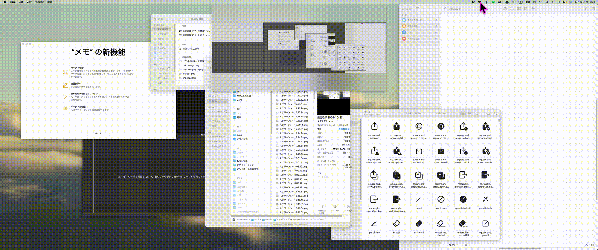

# Ikkini for macOS  
### 全く新しいウィンドウ操作を実現

- [こんな人におすすめ](#こんな人におすすめ)  
- [アプリ概要](#アプリ概要)  
- [インストール](#インストール)
- [使い方](#使い方)
- [Q&A](#qa)
- [バグ](#バグ)

---

## こんな人におすすめ

### 対象者
- **マルチディスプレイ**

    → マルチディスプレイにあるウィンドウを ***Ikkini*** 操作することができる．

- **トラックボール・トラックパッド**
    
    → 仮想モニター上で操作するため**ドラッグ範囲が狭まる**．

### 非推奨
- **macOS専用アプリ**のため、他のOSでは使用できません．
- ショートカットキーでウィンドウを操作する方．

    → ショートカットキーを両手で打ち込む位置に設定しており，
    
    ***片手でウィンドウを操作したい時がある方は推奨***しております．

---

## アプリ概要

***Ikkini***は、マルチディスプレイに散らばったウィンドウを仮想ディスプレイ上で，効率的に操作するためのmacOS専用アプリです。

### 使用イメージ  

---

## インストール  

### 動作環境  
- **macOS**: 12.0 (Monterey) 以降  
- **CPU**: Apple Silicon / Intel 両対応  

### インストール手順  
1. [Releasesページ](https://github.com/kinjo-ryura/Ikkini/releases)から最新版の`Ikkini.dmg`をダウンロード  
2. `.dmg`ファイルを開き、アプリケーションフォルダにドラッグ&ドロップ  
3. 初回起動時に「システム環境設定」 > 「セキュリティとプライバシー」から実行許可を設定  

---

## 使い方

1. **アプリを起動**：`Ikkini`を起動すると、メニューバーにアイコンが表示されます  
2. **仮想ディスプレイを表示**：アイコンをクリック
3. **ウィンドウを操作**：
    - ウィンドウをドラッグ&ドロップで移動
    - ダブルクリックで全体に表示
    - 右クリックで非表示設定

---

## Q&A  

### Q. Ikkiniが起動しない場合の対応は？  
- 「セキュリティとプライバシー」からアクセシビリティの権限を確認してください  

### Q. WindowsやLinuxで使えますか？  
- いいえ、Ikkiniは**macOS専用**です  

---

## ライセンス  

このプロジェクトは**MITライセンス**で提供されています。自由にご利用ください。

---

## バグ

バグ報告や機能提案は[Issues](https://github.com/kinjo-ryura/Ikkini/issues)ページからお願いします。

---

